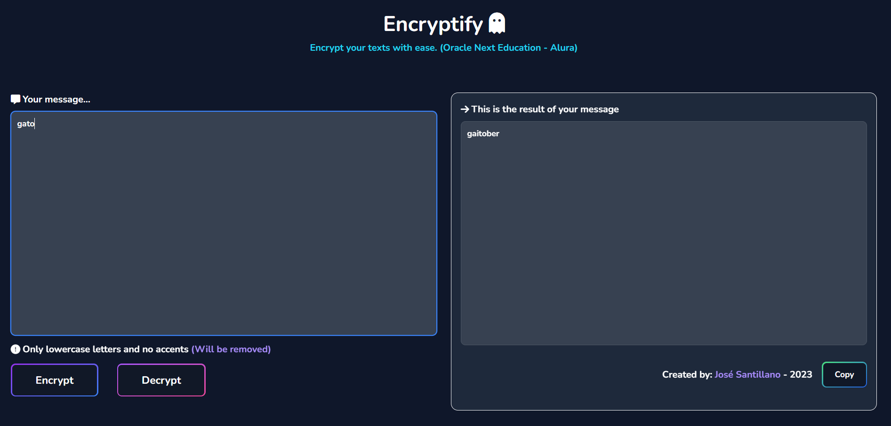
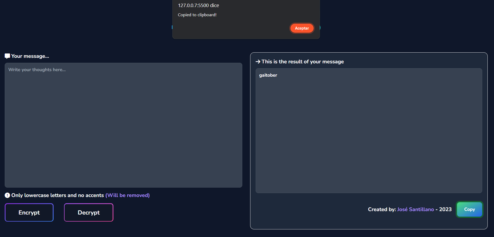

# Encriptador de texto - Alura Challenges ONE
### Encriptador de texto creado con HTML, CSS y JavaScript.
Challenge desarrollado con HTML, CSS y JavaScript.

## Recursos
El proyecto esta creado con las siguientes tecnologías y APIs.

| Plugin                | URL                      |
|-----------------------|--------------------------|
| Tailwind         | https://tailwindcss.com/ |
| Flowbite       | https://flowbite.com/ |
| FontAwesome               | https://fontawesome.com/ |
| Google Fonts          | https://fonts.google.com/ |

## Imagenes

Encriptando texto, este esta validado para aceptar solo letras minusculas. En caso de tener caracteres especiales o numeros seran removidos.

Desencriptado de texto, regresa al mensaje principal y se puede copiar el texto.
